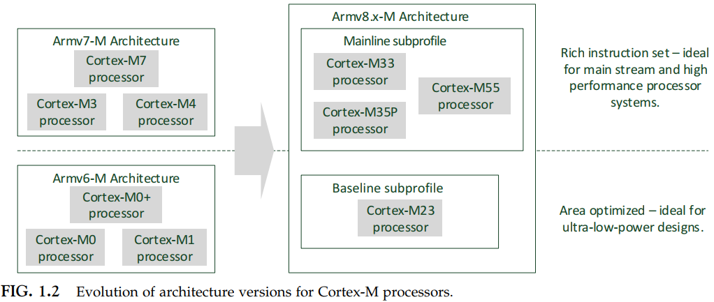

# Chapter 1: Introduction

- Interrupt handling capabilities (p12)
    > Interrupt latency is **15 clocks** cycles in the CM23 and **12 cycles** in CM33 

- OS support
  - shadow stack pointers? system tick timers, and dedicated exceptions types for OS operations
  - more than 40 different types of RTOS running on Cortex-M processors
  
- Microcontroller programming
  - no GUI
  - bare-metal or light RTOS
  - applications access peripheral functions via APIs or device drivers (Vendor provides) in the OS

- Product pages
  - [Cortex-M processor page](https://developer.arm.com/products/processors/cortex-m/)
  - [Cortex-M23 processor page](https://developer.arm.com/products/processors/cortex-m/cortex-m23)
  - [Cortex-M33 processor page](https://developer.arm.com/products/processors/cortex-m/cortex-m33)
  - [M-Profile architecture](https://developer.arm.com/products/architecture/m-profile)
  - [TrustZone](https://developer.arm.com/ip-products/security-ip/trustzone)

- Documents
  - ...

# Chapter 2: Cortex-M programming

- Init
    - Programming the clock control circuitry to enable the clock signal
    - Programming of I/O configurations
    - Programming of the Peripheral configurations
    - Programming of the Interrupt configurations

- User input and output via UART interface

- Embedded software program flows
  1. polling method
     -   